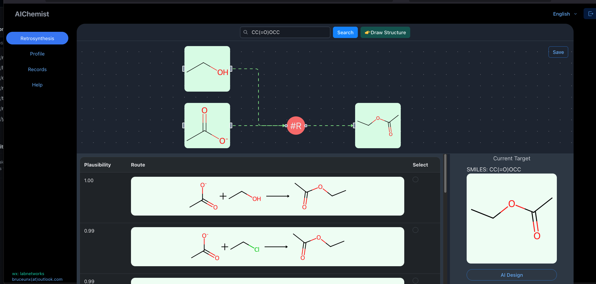
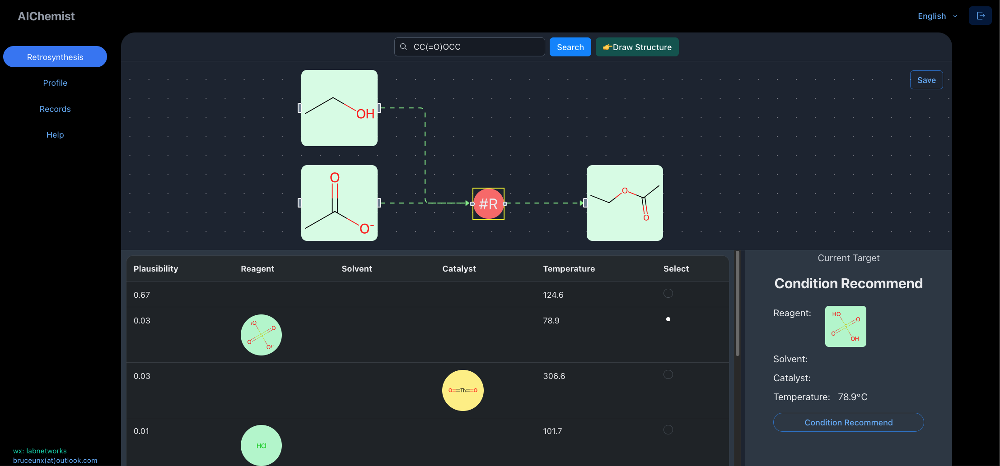

## Retrosynthesis Frontend

- use nextjs and reactflow to handle retrosynthesis frontend

### Screenshots

### AI design synthesis routes and conditions

### TODO

- [x] add user login
- [x] save reaction path to json and to db
