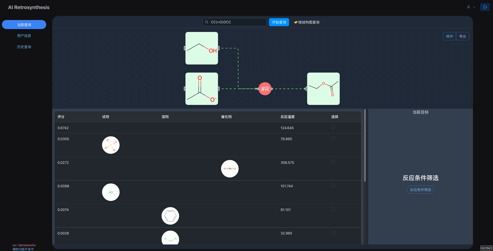

## Retrosynthesis Frontend

- use nextjs and reactflow to handle retrosynthesis frontend

### Screenshots

### AI design synthesis routes and conditions

#### Search synthesis routes and conditions

### TODO
 - [ ] export pdf for each reaction with conditions
 - [ ] save user info and history data
